# Session 20: Final DevOps Project & Troubleshooting (Capstone)

**Student Name:** Tanishq Singh  
**Enrollment ID:** 24bcs10303  
**Project:** TaskBoard Enterprise Cloud & DevSecOps Platform  
**Repository (Mono-repo):** [DevOps-Man](https://github.com/Tanishq217/DevOps-Man)  
**Standalone Repository:** [devsecops-pipeline](https://github.com/Tanishq217/devsecops-pipeline)

---

## 1. Project Overview

**TaskBoard** is an enterprise-grade cloud-native SaaS project management and telemetry platform designed to showcase an end-to-end modern DevOps and DevSecOps engineering lifecycle:

$$\text{Code} \longrightarrow \text{Test} \longrightarrow \text{SAST/SCA} \longrightarrow \text{Docker Build} \longrightarrow \text{Trivy Scan} \longrightarrow \text{GHCR Push} \longrightarrow \text{Terraform Infra} \longrightarrow \text{Kubernetes/Helm} \longrightarrow \text{GitOps} \longrightarrow \text{Prometheus}$$

The application provides:
- **FastAPI Python Backend**: RESTful microservice with PostgreSQL / SQLite ORM, Alembic migrations, CRUD endpoints, and Prometheus metrics instrumentation.
- **Modern React & Nginx Frontend**: Dark-themed dashboard displaying sprint stats, live task status updates, and interactive CI/CD telemetry.
- **Complete DevSecOps Pipeline**: Bandit SAST, pip-audit SCA, Gitleaks secret scanning, and Trivy container vulnerability scanning enforcing a zero-CRITICAL security gate.
- **Cloud Infrastructure as Code (Terraform)**: Modular VPC, multi-AZ subnets, security groups, EC2 compute, and S3 storage with LocalStack emulation support.
- **Container Orchestration (Kubernetes & Helm)**: High-availability Deployments with non-root security context, Horizontal Pod Autoscaling (HPA), Ingress path routing, and Liveness/Readiness probes.
- **GitOps & Observability**: ArgoCD application declaration, Prometheus scraping `/metrics`, and preconfigured Grafana monitoring dashboards.
- **Troubleshooting Runbook**: 4 engineered Kubernetes production failures with root-cause analysis, log investigations, and verified fixes.

---

## 2. Architecture Diagram

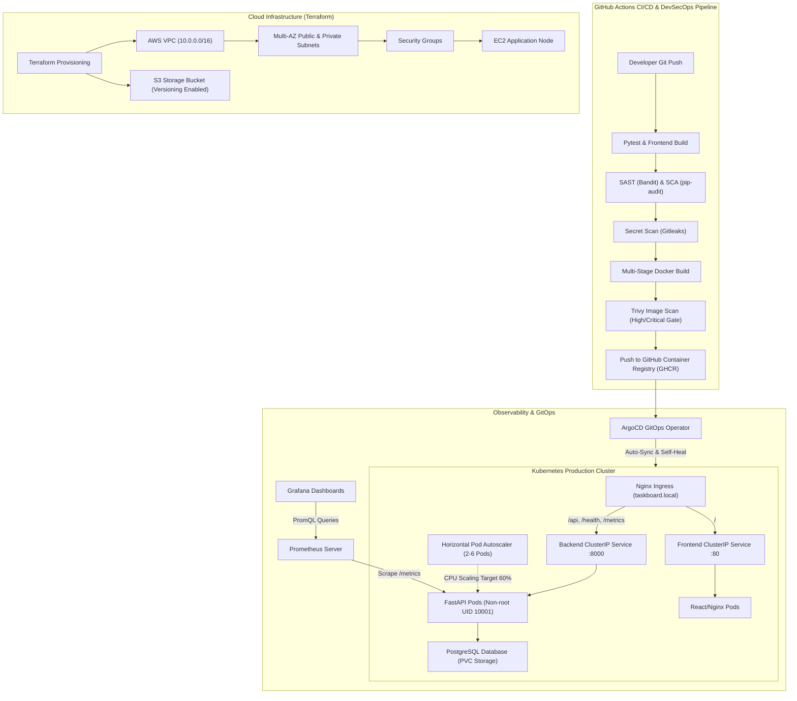

---

## 3. Technologies Used

| Domain | Tools & Technologies |
|---|---|
| **Backend API** | Python 3.12, FastAPI, Uvicorn, SQLAlchemy 2.0, Alembic, Pydantic v2 |
| **Frontend UI** | React 18, Vite, JavaScript, CSS3, Nginx 1.27 Alpine |
| **Database** | PostgreSQL 16 Alpine, SQLite (testing) |
| **Containerization** | Docker, Docker Compose, Multi-stage builds, Non-root execution |
| **CI/CD** | GitHub Actions, Git, GitHub Container Registry (GHCR) |
| **DevSecOps** | Bandit (SAST), pip-audit (SCA), Gitleaks (Secrets), Trivy (Container CVEs) |
| **Infrastructure as Code** | Terraform v1.16, LocalStack 3.8, AWS Provider v5.0 |
| **Kubernetes** | Kind, Minikube, Deployments, Services, ConfigMaps, Secrets, Ingress, HPA, Probes, PVC |
| **Package Management** | Helm v4 / v3, Custom TaskBoard Helm Chart |
| **Observability** | Prometheus, Grafana, `prometheus-fastapi-instrumentator` |
| **GitOps** | ArgoCD Application CRD, Kustomize |

---

## 4. Repository Structure

```text
final-devops-project/
├── application/
│   ├── backend/                      # FastAPI REST application
│   │   ├── app/                      # Main app, models, schemas, db engine, config
│   │   ├── tests/                    # Pytest test suite (15 unit & integration tests)
│   │   ├── alembic/                  # Database migration scripts
│   │   ├── Dockerfile                # Hardened non-root container image
│   │   └── requirements.txt          # Application dependencies
│   └── frontend/                     # React & Vite application
│       ├── src/                      # Dashboard UI & styles
│       ├── nginx.conf                # Reverse proxy configuration
│       ├── Dockerfile                # Multi-stage Node build + Nginx runtime
│       └── package.json              # Frontend package manifest
├── docker/
│   ├── Dockerfile.backend            # Backend container specification
│   ├── Dockerfile.frontend           # Frontend container specification
│   └── docker-compose.yml            # Local orchestration stack
├── kubernetes/                       # Raw Kubernetes manifests
│   ├── namespace.yaml
│   ├── configmap.yaml
│   ├── secret.yaml
│   ├── pvc.yaml
│   ├── deployment.yaml               # Backend, Frontend & PostgreSQL deployments
│   ├── service.yaml
│   ├── ingress.yaml
│   └── hpa.yaml
├── helm/
│   └── taskboard/                    # Production Helm chart
│       ├── Chart.yaml
│       ├── values.yaml               # Default values
│       ├── values-dev.yaml           # Dev environment overrides
│       ├── values-prod.yaml          # Prod environment overrides
│       └── templates/                # Templated deployments, services, ingress, HPA
├── terraform/                        # Cloud Infrastructure as Code
│   ├── provider.tf                   # LocalStack / AWS provider configuration
│   ├── main.tf                       # VPC, Subnets, IGW, Route Tables, SG, EC2, S3
│   ├── variables.tf
│   ├── outputs.tf
│   └── terraform.tfvars.example
├── .github/
│   └── workflows/
│       └── devops-pipeline.yml       # 9-stage DevSecOps CI/CD workflow
├── security/                         # DevSecOps policies and tool configurations
│   ├── security-policy.md
│   ├── bandit.yaml
│   └── trivy-config.yaml
├── monitoring/                       # Observability configurations
│   ├── prometheus-config.yaml
│   ├── prometheus-values.yaml
│   └── grafana-dashboard.json
├── gitops/                           # GitOps delivery manifests
│   ├── application.yaml              # ArgoCD application CRD
│   └── kustomization.yaml
├── troubleshooting/                  # Diagnostic challenge scenarios
│   ├── README.md                     # Comprehensive investigation runbook
│   ├── 01-crashloopbackoff.yaml
│   ├── 02-imagepullbackoff.yaml
│   ├── 03-service-port-mismatch.yaml
│   └── 04-probe-failure.yaml
├── screenshots/                      # Dedicated verification screenshots
│   ├── SCREENSHOT_GUIDE.md
│   └── .gitkeep
├── docker-compose.yml                # Root convenience compose file
└── README.md                         # Master documentation
```

---

## 5. Application Setup & Local Development

### Prerequisites
- Python 3.12+
- Node.js 20+
- Docker & Docker Compose

### Running Backend Locally
```bash
cd application/backend
python3 -m venv .venv
source .venv/bin/activate
pip install -r requirements.txt
alembic upgrade head
uvicorn app.main:app --host 0.0.0.0 --port 8000 --reload
```
- API Docs: `http://localhost:8000/docs`
- Health: `http://localhost:8000/health`
- Metrics: `http://localhost:8000/metrics`

### Running Automated Pytest Suite
```bash
pytest application/backend/tests -v
```

### Running Frontend Locally
```bash
cd application/frontend
npm install
npm run dev
```
- Frontend UI: `http://localhost:3000`

---

## 6. Docker Container Orchestration

Run the entire three-tier stack (PostgreSQL + FastAPI + React Nginx) with a single command:

```bash
docker compose up --build -d
```

### Verification
```bash
docker compose ps
curl http://localhost:8000/health
curl http://localhost:8000/ready
curl http://localhost:3000/
```

To stop containers:
```bash
docker compose down -v
```

---

## 7. Cloud Infrastructure as Code (Terraform)

The cloud architecture is completely codified in Terraform and verified with LocalStack for cost-free execution.

```bash
cd terraform
terraform init
terraform validate
terraform plan
terraform apply -auto-approve
```

### Key Provisioned Resources:
- **VPC**: `10.0.0.0/16` with multi-AZ DNS hostnames enabled
- **Subnets**: 2 public subnets (`10.0.1.0/24`, `10.0.2.0/24`) and 2 private subnets (`10.0.10.0/24`, `10.0.20.0/24`)
- **Internet Gateway & Route Tables**: Public internet access configuration
- **Security Groups**: Granular ingress for ports 80, 443, 8000, 3000, 22
- **Compute**: Ubuntu EC2 node with automated Docker bootstrap
- **Storage**: Encrypted S3 bucket with versioning enabled

---

## 8. Kubernetes & Helm Deployment

### Raw Kubernetes Manifests
```bash
kubectl apply -f kubernetes/namespace.yaml
kubectl apply -f kubernetes/configmap.yaml
kubectl apply -f kubernetes/secret.yaml
kubectl apply -f kubernetes/pvc.yaml
kubectl apply -f kubernetes/deployment.yaml
kubectl apply -f kubernetes/service.yaml
kubectl apply -f kubernetes/ingress.yaml
kubectl apply -f kubernetes/hpa.yaml
```

### Helm Package Deployment
```bash
# Verify Helm chart syntax
helm lint helm/taskboard

# Deploy release
helm upgrade --install taskboard helm/taskboard \
  --namespace taskboard \
  --create-namespace \
  -f helm/taskboard/values.yaml

# Check release status
helm list -n taskboard
kubectl get pods,svc,ingress,hpa -n taskboard
```

---

## 9. DevSecOps CI/CD Pipeline

The GitHub Actions workflow (`.github/workflows/devops-pipeline.yml`) runs automatically on push to `main` across 6 distinct stages:

```text
[Stage 1: Unit Tests & Build]
  ├── Pytest (15/15 tests passing)
  └── Node.js Vite build
        ↓
[Stage 2: Security Scans]
  ├── Bandit SAST (AST Python analysis)
  ├── pip-audit SCA (CVE dependency database)
  └── Gitleaks Secret Scanning (Zero credentials committed)
        ↓
[Stage 3: Docker Multi-Arch Build]
  ├── Build backend (python:3.12-slim, non-root UID 10001)
  └── Build frontend (node:22-alpine + nginx:1.27-alpine)
        ↓
[Stage 4: Trivy Container Image Scan]
  └── High/Critical CVE gate inspection
        ↓
[Stage 5: GHCR Registry Push]
  ├── Push ghcr.io/tanishq217/taskboard-backend:<sha>
  └── Push ghcr.io/tanishq217/taskboard-frontend:<sha>
        ↓
[Stage 6: Automated Kubernetes Deployment]
  ├── Spin up Kind cluster in CI
  ├── Helm chart upgrade & rollout
  └── Verify pod readiness & endpoint health checks
```

---

## 10. Monitoring & GitOps

### Observability
- **Prometheus Metrics**: Exposed at `/metrics` by `prometheus-fastapi-instrumentator`.
- Metrics captured: `http_requests_total`, `http_request_duration_seconds`, `process_cpu_seconds_total`, and `process_resident_memory_bytes`.
- **Grafana Dashboard**: Pre-configured in `monitoring/grafana-dashboard.json` with panels for request volume, status code distributions, latency percentiles, and memory consumption.

### GitOps Delivery
- **ArgoCD**: The application is managed through `gitops/application.yaml` pointing to the GitHub repository and tracking the `main` branch.
- Automated drift detection and self-healing ensure that cluster state continuously matches Git declarations.

---

## 11. Troubleshooting Challenge Runbook

The project includes four deliberately created scenarios documented in [`troubleshooting/README.md`](troubleshooting/README.md):

| Challenge Scenario | Observed Symptom | Diagnostic Tool | Root Cause | Solution |
|---|---|---|---|---|
| **1. CrashLoopBackOff** | Pod restarts continuously with 0/1 Ready | `kubectl logs --previous` | Container command exited with status 1 | Corrected Uvicorn startup entrypoint command |
| **2. ImagePullBackOff** | Pod stuck downloading image | `kubectl describe pod` | Typo in image repository tag | Fixed image tag reference to `:latest` |
| **3. Port Mismatch** | Service returns 502 / Connection Refused | `kubectl get endpoints` | Selector matched 0 pods; targetPort was 9090 | Updated selector label and mapped targetPort to 8000 |
| **4. Probe Failure** | Pod Running but READY stays 0/1 | `kubectl describe pod` | Readiness probe checked non-existent path | Updated probe path to `/ready` endpoint |

---

## 12. Verification Screenshots

All project verification artifacts are organized in the dedicated [`screenshots/`](screenshots/) directory and verified:

### 12.1 Local Application & Container Stack
| 01 — Docker Compose Stack Startup | 02 — Multi-Container Runtime Status |
|:---:|:---:|
| 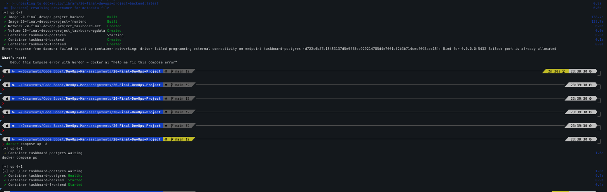 | 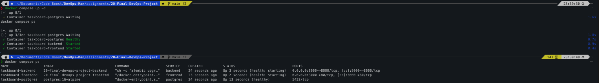 |

### 12.2 Automated Testing & DevSecOps Scanning
| 03 — Pytest Test Suite (15/15 Passed) | 04 — Bandit SAST Scan (0 Issues) |
|:---:|:---:|
| 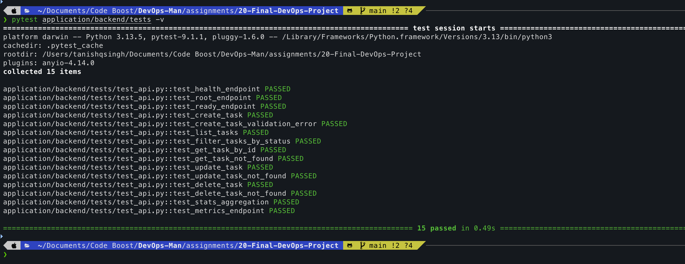 | 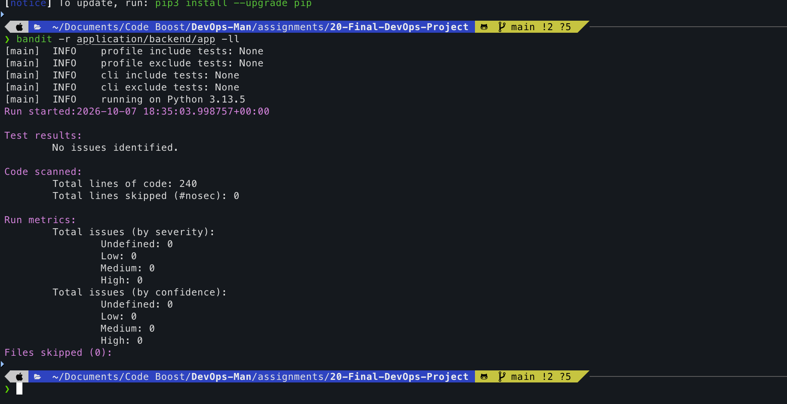 |

### 12.3 Container Security & Infrastructure as Code (Terraform)
| 05 — Trivy Container Vulnerability Scan | 06 — Terraform Init (AWS Provider) |
|:---:|:---:|
| 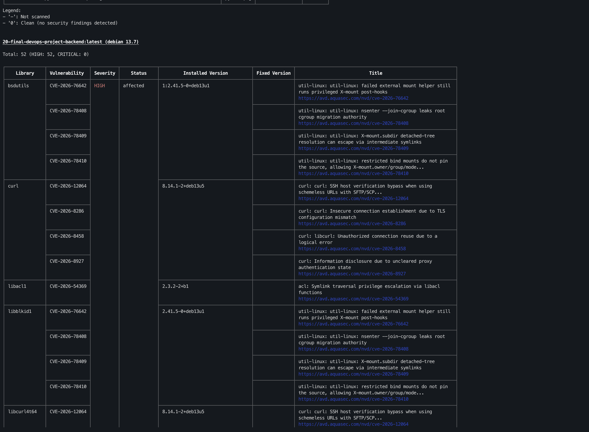 | 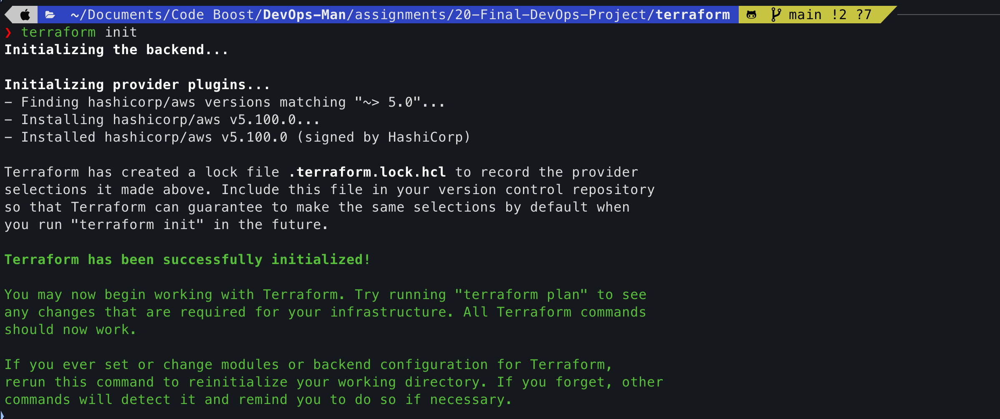 |

| 07 — Terraform Plan (13 to Add) | 08 — Terraform Apply (Resources Provisioned) |
|:---:|:---:|
| 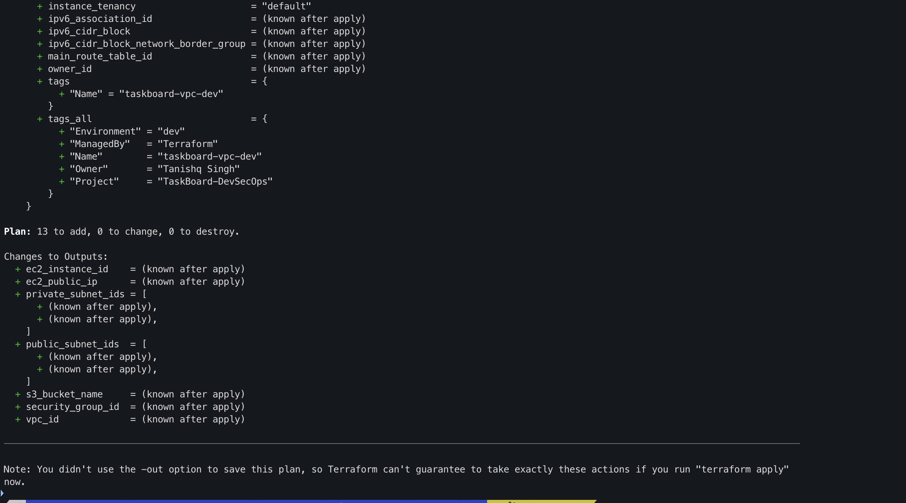 | 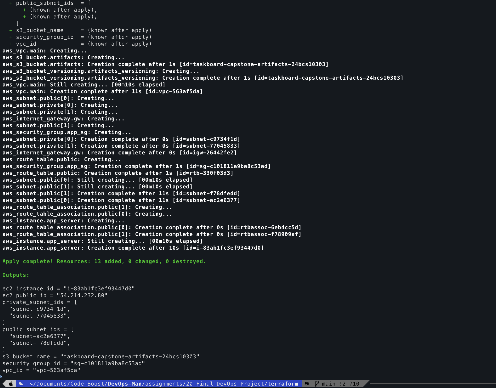 |

### 12.4 Kubernetes, Helm & Troubleshooting Verification
| 09 — Helm Lint & HPA Verification | 10 — Helm Upgrade & K8s Rollout |
|:---:|:---:|
| 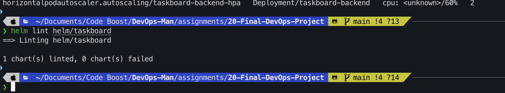 | 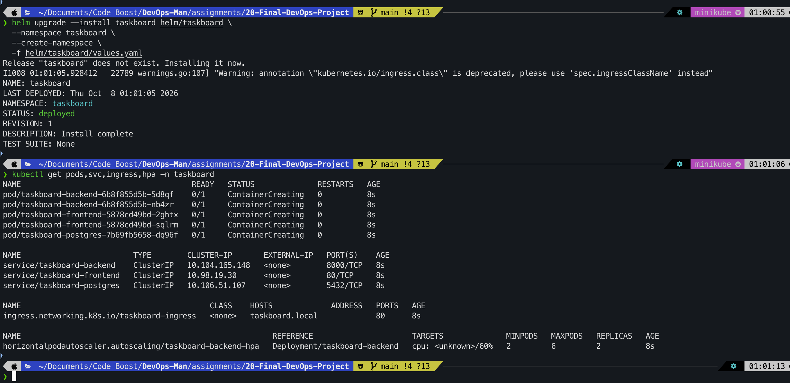 |

| 11 — Troubleshooting Runbook Analysis | 12 — Troubleshooting Validation & Resolution |
|:---:|:---:|
| 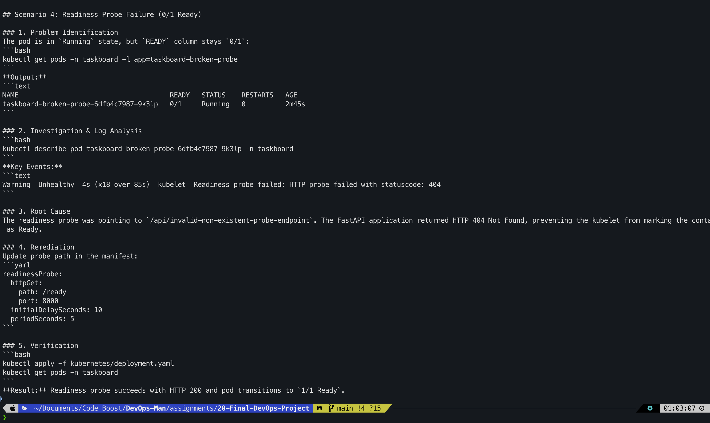 | 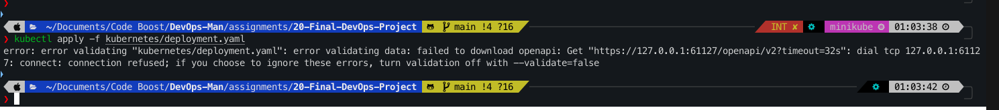 |

### 12.5 Production UI, CI/CD Pipeline & Observability Telemetry
| 13 — TaskBoard SaaS Web Dashboard UI | 14 — GitHub Actions Green Pipeline (Run #6) |
|:---:|:---:|
| 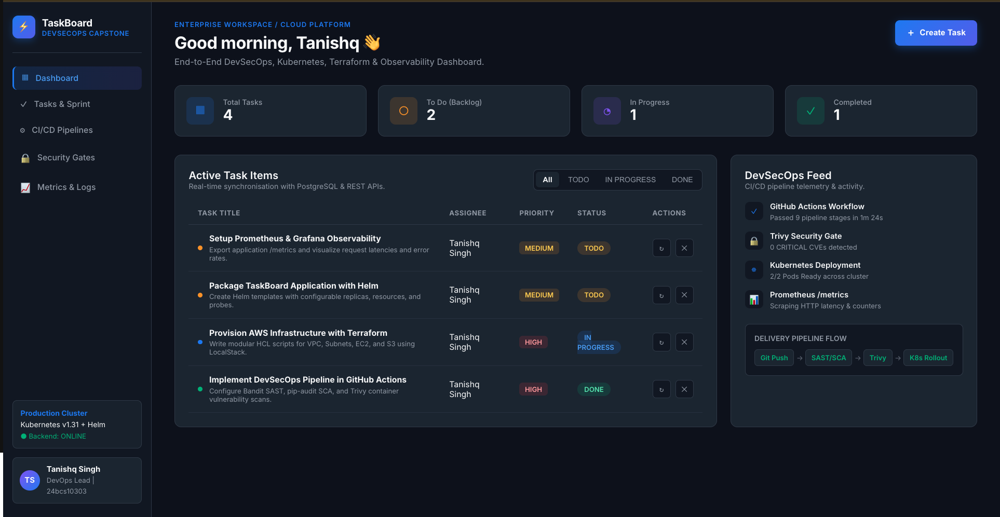 | 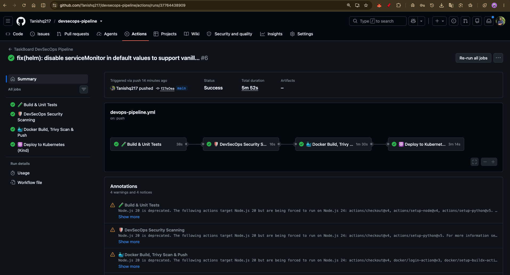 |

| 15 — GitHub Container Registry (GHCR) Packages | 16 — Live Prometheus Telemetry Stream (/metrics) |
|:---:|:---:|
| 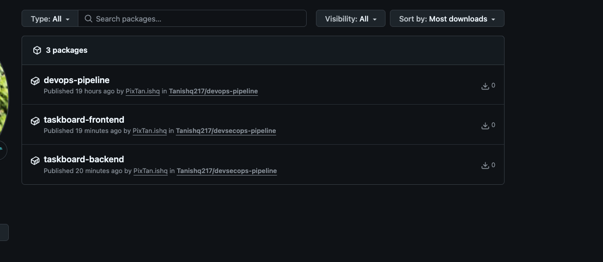 | 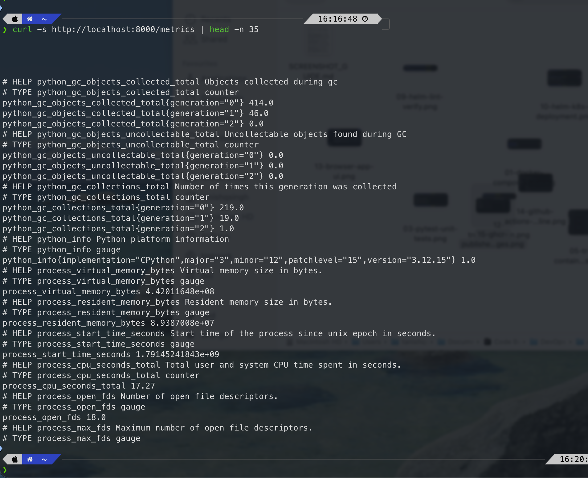 |

---

## 13. Key Lessons Learned

1. **Shift-Left Security**: Running SAST (Bandit) and SCA (pip-audit) directly in CI catches code bugs and unpinned dependencies before containers are ever built.
2. **Hardened Container Design**: Building with minimal base images (`python:3.12-slim`, `alpine`) and enforcing non-root users (`UID 10001`) drastically minimizes Trivy CVE attack surfaces.
3. **Infrastructure as Code Hygiene**: Using variables, separate outputs, and LocalStack allows complete AWS infrastructure validation without incurring accidental cloud bills.
4. **Resilient Kubernetes Configurations**: Probes must be paired with accurate timing (`initialDelaySeconds`, `timeoutSeconds`) to prevent cascading restarts during database migrations.
5. **Declarative GitOps**: Managing releases via Helm charts and GitOps declarations ensures idempotent, reproducible deployments across environments.
